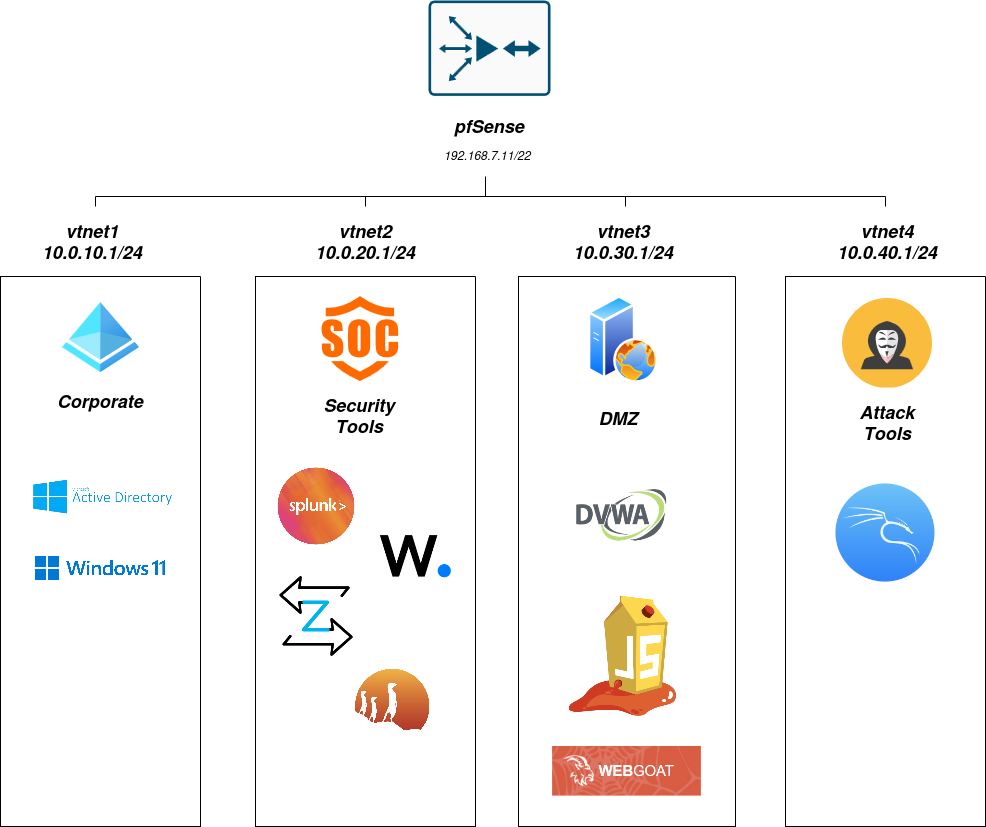

# Cyber-Lab & Cybersecurity Research 

A comprehensive hands-on cybersecurity learning environment built for practical SOC analyst skill development and CCDC competition preparation.

## 🎯 Overview

This homelab provides a full-featured security operations center (SOC) environment for developing detection engineering, log analysis, and incident response skills. The lab emphasizes hands-on learning through real-world attack and defense scenarios. 

## 🗺️ Architecture



## 🔒 Tech Stack 
 - **Virtualization**: Proxmox VE
 - **Network Security**: pfSense
 - **SIEM**: Splunk
 - **EDR/XDR**: Wazuh
 - **Network Monitoring**: Zeek, Suricata

## 🚧 Repository Structure 

```
├── docs/              # Setup guides and documentation
├── diagrams/          # Network topology and architecture diagrams
├── configs/           # Sanitized configuration files
├── detection-rules/   # Custom detection rules and signatures
├── learnings/         # Personal learning journey and notes
└── scenarios/         # Attack/defense scenarios and writeups
```

## 🧠 Skills Demonstrated

 - Network segmentation
 - Security information and event management (SIEM)
 - Log aggregation and analysis
 - Intrusion detection and prevention
 - Security monitoring and alerting
 - Incident detection and response
 - Threat hunting

## 💪 Current Status

🚧 **In Progress** - Actively building and documenting

## 🎓 More About Me 

This is part of my cybersecurity portfolio as I work toward an entry-level SOC analyst position. I'm building hands-on projects to demonstrate real-world security skills.

**Author:** Ethan Martin  
**University:** California State University, Channel Islands  
**Major:** Information Technology  
**Club:** Treasurer, Ethical Hackers of Channel Islands

[LinkedIn](https://www.linkedin.com/in/ethan-m-825069167/) |
[Blog](https://dev.to/ethan_ac5ca38abc559d950c9)

--- 

This is a personal learning project, but feedback and suggestions are welcome!

⭐ **Star this repo if you find it useful or interesting!**

